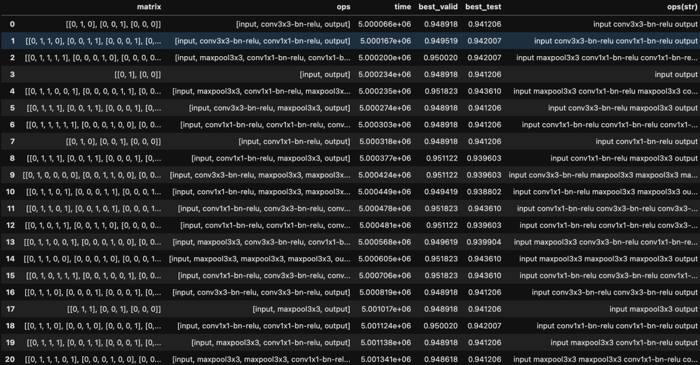
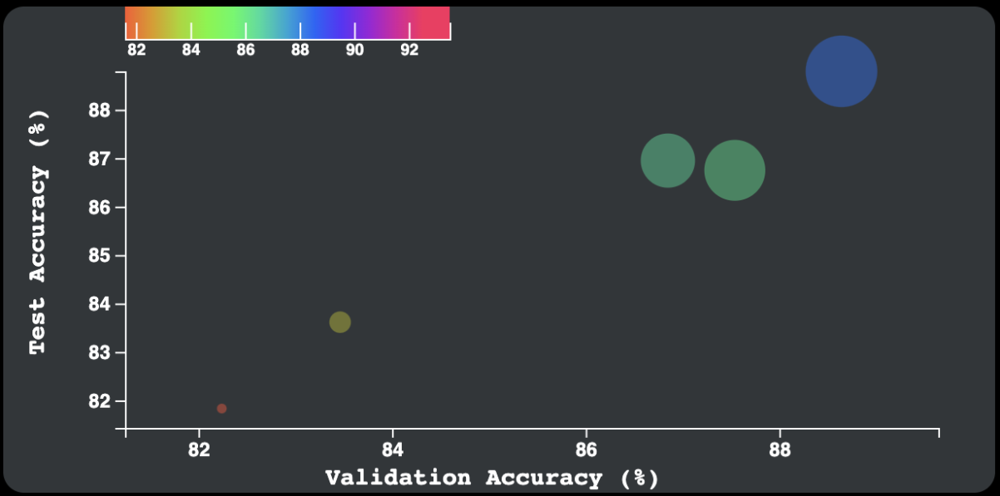
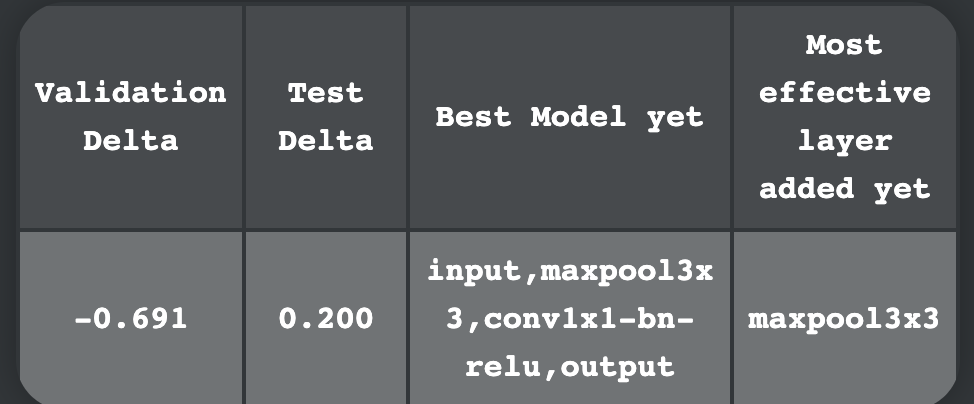
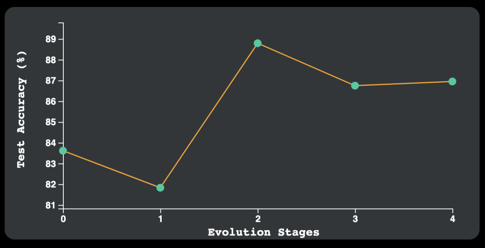
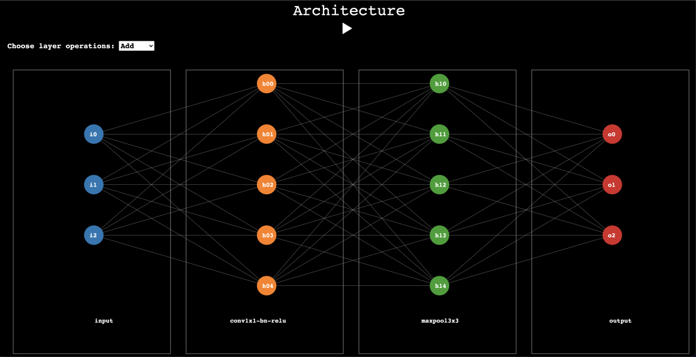
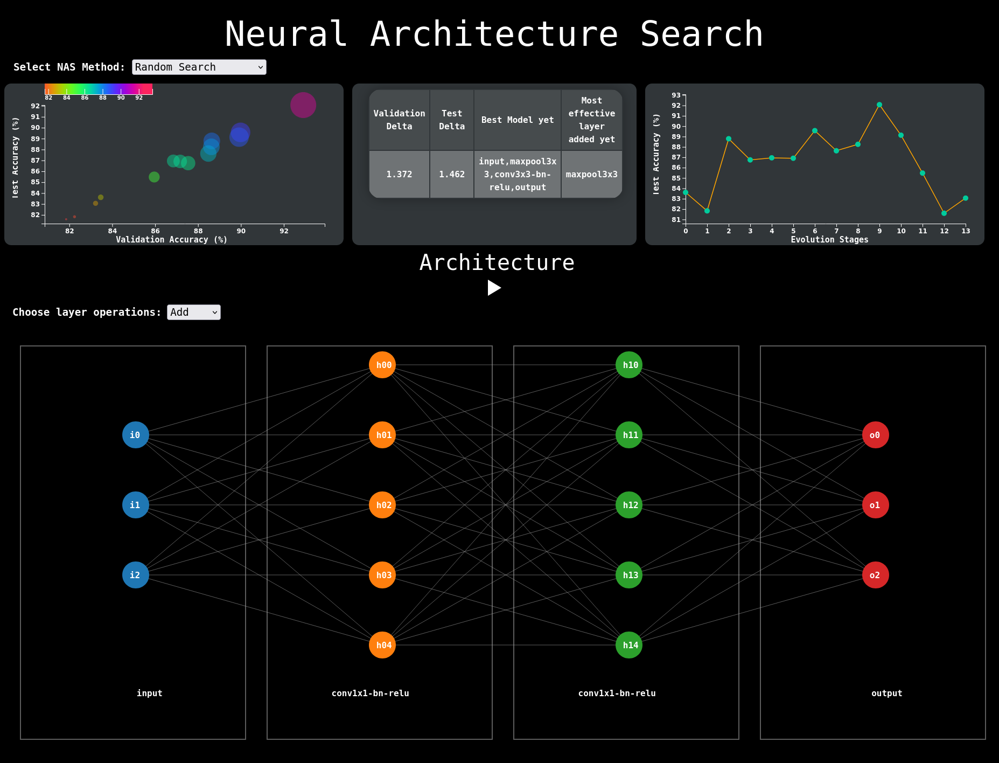

# Visualizing NAS
## CSE 578 Mentored Project 5

### Project Description
This project creates a visual dashboard with different interactive vizualizations which can be used to steer a NAS process.

### How to run the project?
The program is run using vanilla Javascript and Python HTTP server.

Run the server Python HTTP server in the project directory i.e. the directory where index.html file is located. Open the terminal in that directory and enter:

```
$ python3 -m http.server 8080
```

Pressing enter would result in similar lines being printed on the terminal:

```
Serving HTTP on 0.0.0.0 port 8080 (http://0.0.0.0:8080/) ...
```

Right click on the link in the brackets and open the link, or copy the link above in the browser to load the webpage.

### Project Details
#### Dataset
We have used a small snapshot from NAS-bench 101 dataset, and curated it to suit our visualizations tasks. We used data from two NAS processes i.e. Random Search and Evolutionary Search process. 



#### Scatterplot
The scatterplot is plotted for each architecture from the selected dataset, by plotting the validation accuracy against test accuracy, and the radius of the circle representing the test accuracy for each Architecture. 



#### Summary Table
The summary table describes the Change in both Validation and Test accuracy compared the to the previous iteration, and displays the best model yet and the most effective layer added.

Here the most effective layer would be the layer that was reponsible for the best positive Test Accuracy change.



#### Line Chart
The line chart helps to understand the progression from the first iteration of the NAS process to the last by helping us visualize the accuracy change.



#### Architecture
The architecture visualization provides the user with an overview of the Neural Network. Different layers are displayed with the ability to add new layers and or deleted new layers to steer the NAS process based on the user's choices.



#### Interactions


Each visualization interacts with each other. When we press the play button the webpage runs through each iteration of the NAS, and displays the results on each visualization accordingly. 

The user can pause the automated process and manually add or remove a particular layer by choosing the option and clicking on that layer. 

The user can also look back at a particular architecture by selecting it from either the line chart or the scatter plot. The corresponding architecture will be displayed. If the user decides to follow a different path from this, they can manually choose the new layer to add/delete. And they can also then later let the NAS resume it's automated search by pressing the play button.


### Group Members:
1. Pravar Parekh
2. Abhineeth Mishra
3. Darshil Shah
4. Shrutwa Shah
5. Fenny Zalavadia
6. Eric Murari